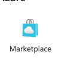
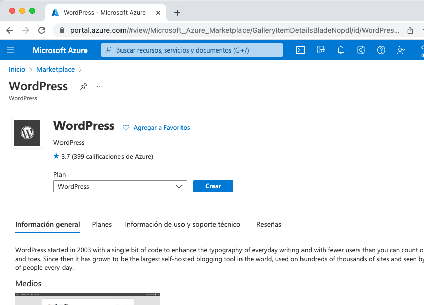
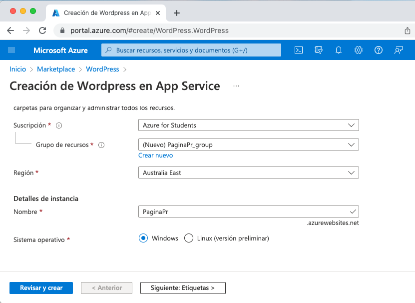
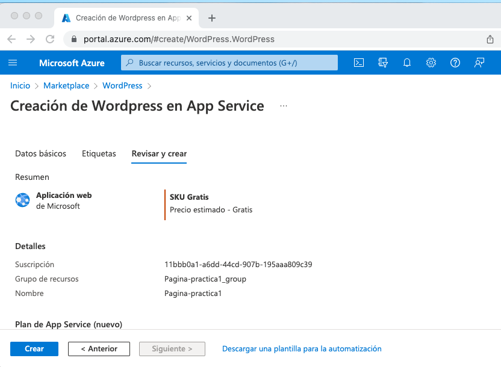
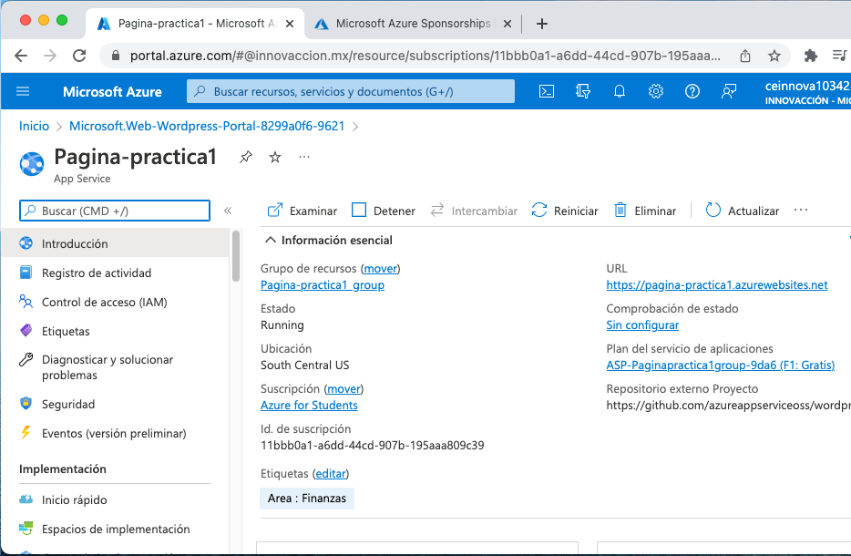
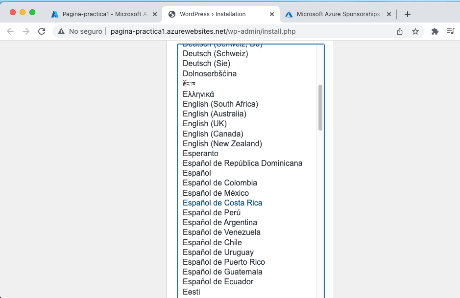
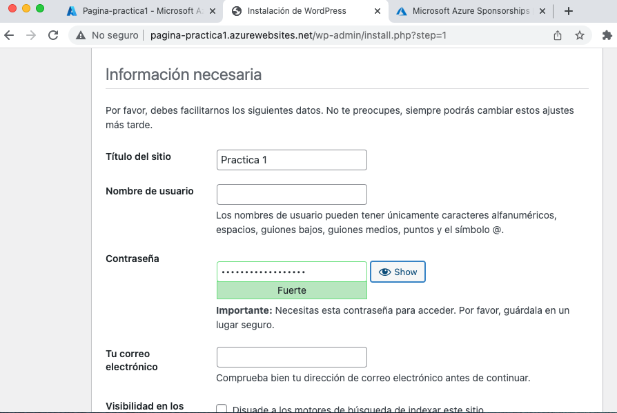
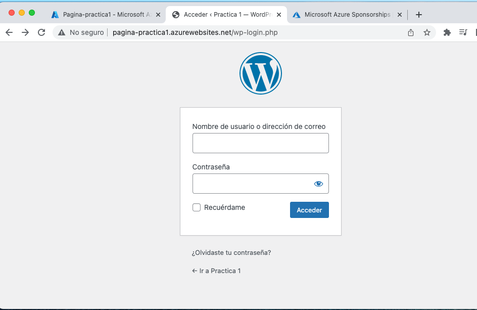
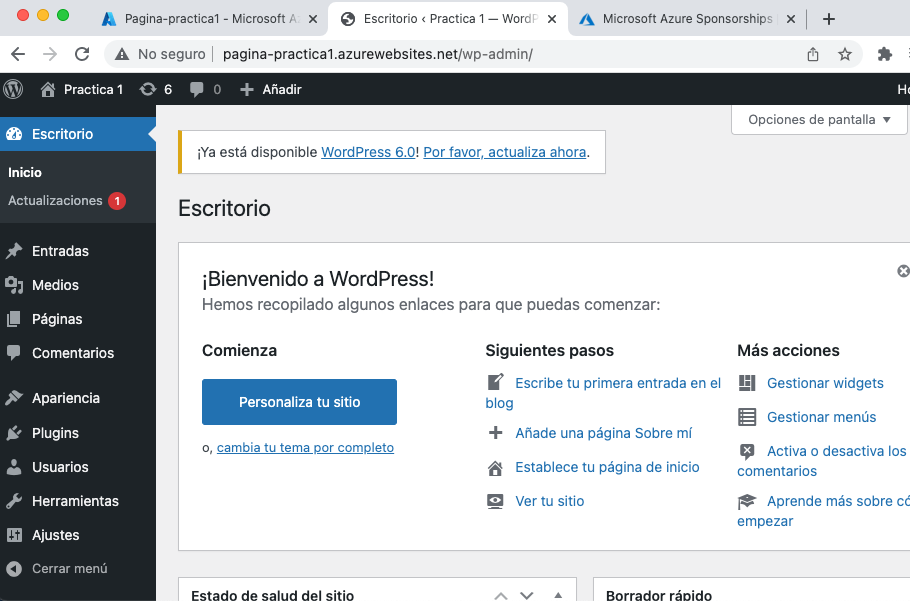

#Azure
##Practica 1: Creación de pagina con wordpress

En esta practica vamos a crear una pagina de wordpress utilizando Azure.

Primero vamos a Portal.Azure.com y en el buscador buscamos marketplace.

Damos click en la opción que aparece en la imagen y le damos en crear.

Creamos un grupo de recursos y llenamos los demas datos

Revisamos y creamos

Vamos al recurso y damos click en la URL de nuetra pagina

La primera vez que entremos nos pedira el idioma asi que seleccionamos el que queramos.

Llenamos los demas datos que nos piden y creamos un usuario y contraseña para el sitio.

Una vez terminado vamos al dominio y ponemos wp-admin para acceder a la configuración del sitio. Nos pedira iniciar sesion asi que colocamos el usuario y contraseña que creamos.

Ya puedes configurar tu pagina.

# Practica-1
# Practica-1
# Practica-1
